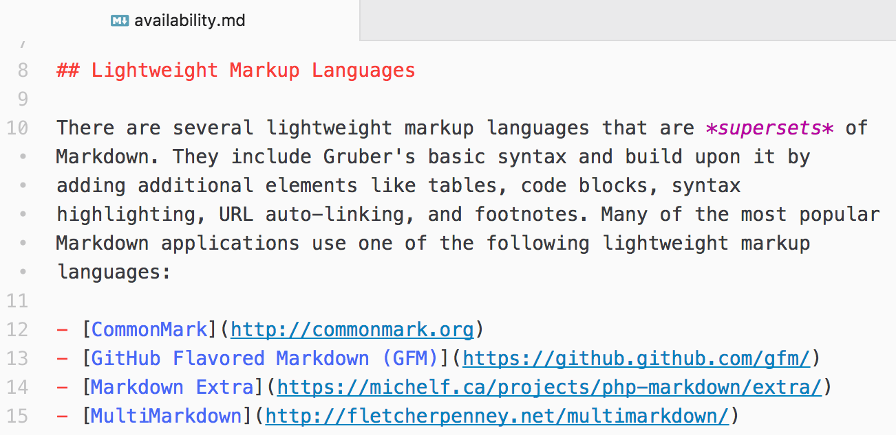
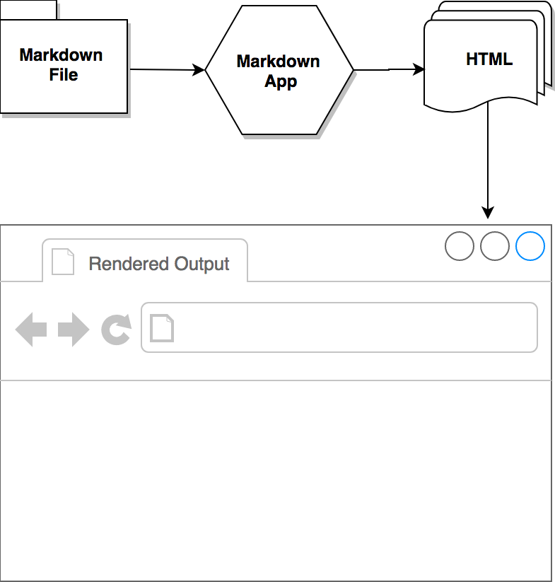

{mainmatter}

# Getting Started {#getting-started}

Markdown is a lightweight markup language that you can use to add formatting elements to plaintext text documents. Created by John Gruber in 2004, Markdown is now one of the world's most popular markup languages.

Using Markdown is different than using a [WYSIWYG](https://en.wikipedia.org/wiki/WYSIWYG) editor. In an application like Microsoft Word, you click buttons to format words and phrases, and the changes are visible immediately. Markdown isn't like that. When you create a Markdown-formatted file, you add Markdown syntax to the text to indicate which words and phrases should look different.

For example, to denote a heading, you add a number sign before it (e.g., `# Heading One`). Or to make a phrase bold, you add two asterisks before and after it (e.g., `**this text is bold**`). It may take a while to get used to seeing Markdown syntax in your text, especially if you're accustomed to WYSIWYG applications. The screenshot below shows a Markdown file displayed in the [Atom text editor](https://atom.io).

You can add Markdown formatting elements to a plaintext file using a text editor application. Or you can use one of the many Markdown applications for macOS, Windows, Linux, iOS, and Android operating systems. There are also several web-based applications specifically designed for writing in Markdown.

Depending on the application you use, you may not be able to preview the formatted document in real time. But that's okay. [According to Gruber](http://daringfireball.net/projects/markdown/), Markdown syntax is designed to be readable and unobtrusive, so the text in Markdown files can be read even if it isn't rendered.

> The overriding design goal for Markdown’s formatting syntax is to make it as readable as possible. The idea is that a Markdown-formatted document should be publishable as-is, as plain text, without looking like it’s been marked up with tags or formatting instructions.

## Why Use Markdown?

You might be wondering why people use Markdown instead of a WYSIWYG editor. Why write with Markdown when you can press buttons in an interface to format your text? As it turns out, there are a couple different reasons why people use Markdown instead of WYSIWYG editors.

- Markdown can be used for everything. People use it to create websites, documents, notes, books, presentations, email messages, and technical documentation.

- Markdown is portable. Files containing Markdown-formatted text can be opened using virtually any application. If you decide you don't like the Markdown application you're currently using, you can import your Markdown files into another Markdown application. That's in stark contrast to word processing applications like Microsoft Word that lock your content into a proprietary file format.

- Markdown is platform independent. You can create Markdown-formatted text on any device running any operating system.

- Markdown is future proof. Even if the application you're using stops working at some point in the future, you'll still be able to read your Markdown-formatted text using a text editing application. This is an important consideration when it comes to books, university theses, and other milestone documents that need to be preserved indefinitely.

- Markdown is everywhere. Websites like Reddit and GitHub support Markdown, and lots of desktop and web-based applications support it.

## Kicking the Tires

The best way to get started with Markdown is to use it. That's easier than ever before thanks to a variety of free tools.

You don't even need to download anything. There are several online Markdown editors that you can use to try writing in Markdown. [Dillinger](https://dillinger.io/) is one of the best online Markdown editors. Just open the site and start typing in the left pane. A preview of the rendered document appears in the right pane.

You'll probably want to keep the Dillinger website open as you read through this guide. That way you can try the syntax as you learn about it. After you've become familiar with Markdown, you may want to use a Markdown application that can be installed on your desktop computer or mobile device.

## How Markdown Works {#how-markdown-works}

Dillinger makes writing in Markdown easy because it hides the stuff happening behind the scenes, but it's worth exploring how the process works in general.

When you write in Markdown, the text is stored in a plaintext file that has an `.md` or `.markdown` extension. But then what? How is your Markdown-formatted file converted into HTML or a print-ready document?

The short answer is that you need a *Markdown application* capable of processing the Markdown file. There are lots of applications available — everything from simple scripts to desktop applications that look like Microsoft Word. Despite their visual differences, all of the applications do the same thing. Like Dillinger, they all convert Markdown-formatted text to HTML so it can be displayed in web browsers.

Markdown applications use something called a *Markdown processor* (also commonly referred to as a "parser" or an "implementation") to take the Markdown-formatted text and output it to HTML format. At that point, your document can be viewed in a web browser or combined with a style sheet and printed. You can see a visual representation of this process below.

I> The Markdown application and processor are two separate components. For the sake of brevity, I've combined them into one element ("Markdown app") in the figure below.

{width=100%}

To summarize, this is a four-part process:

1. Create a Markdown file using a text editor or a dedicated Markdown application. The file should have an `.md` or `.markdown` extension.
2. Open the Markdown file in a Markdown application.
3. Use the Markdown application to convert the Markdown file to an HTML document.
4. View the HTML file in a web browser or use the Markdown application to convert it to another file format, like PDF.

From your perspective, the process will vary somewhat depending on the application you use. For example, Dillinger essentially combines steps 1-3 into a single, seamless interface — all you have to do is type in the left pane and the rendered output magically appears in the right pane. But if you use other tools, like a text editor with a static website generator, you'll find that the process is much more visible.

## Flavors of Markdown

One of the most confusing aspects of using Markdown is that practically every Markdown application implements a slightly different version of Markdown. These variants of Markdown are commonly referred to as *flavors*. It's your job to master whatever flavor of Markdown your application has implemented.

To wrap your head around the concept of Markdown flavors, it might help to think of them as language dialects. People in New York City speak English just like the people in London, but there are substantial differences between the dialects used in both cities. The same is true for people using different Markdown applications. Using [Dillinger](https://www.markdownguide.org/tools/dillinger/) to write with Markdown is a vastly different experience than using [Ulysses](https://www.markdownguide.org/tools/ulysses/).

Practically speaking, this means you never know exactly what a company means when they say they support "Markdown." Are they talking about only the [basic syntax elements](#basic-syntax), or all of the basic and [extended syntax elements](#extended-syntax) combined, or some arbitrary combination of syntax elements? You won't know until you read the documentation or start using the application.

If you're just starting out, the best advice I can give you is to pick a Markdown application with good Markdown support. That'll go a long way towards maintaining the portability of your Markdown files. You might want to store and use your Markdown files in other applications, and to do that you need to start with an application that provides good support. You can use the [tool directory](https://www.markdownguide.org/tools/) to find an application that fits the bill.

## Additional Resources

There are lots of other resources you can use to learn Markdown. Here are a few of my favorites:

- [John Gruber’s Markdown documentation](https://daringfireball.net/projects/markdown/). The original guide written by the creator of Markdown.
- [Markdown Tutorial](https://www.markdowntutorial.com/). An open source website that allows you to try Markdown in your web browser.
- [Awesome Markdown](https://github.com/mundimark/awesome-markdown). A list of Markdown tools and learning resources.
- [Typesetting Markdown](https://dave.autonoma.ca/blog/2019/05/22/typesetting-markdown-part-1). A multi-part series that describes an ecosystem for typesetting Markdown documents using [pandoc](https://pandoc.org/) and [ConTeXt](https://www.contextgarden.net/).
