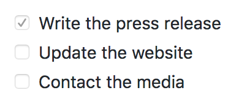

# Extended Syntax {#extended-syntax}

The [basic syntax](#basic-syntax) outlined in John Gruber's original design document added many of the elements needed on a day-to-day basis, but it wasn't enough for some people. That's where extended syntax comes in.

Several individuals and organizations took it upon themselves to extend the basic syntax by adding additional elements like tables, code blocks, syntax highlighting, URL auto-linking, and footnotes. These elements can be enabled by using a lightweight markup language that builds upon the basic Markdown syntax, or by adding an extension to a compatible Markdown processor.

## Availability

Not all Markdown applications support extended syntax elements. You’ll need to check whether or not the lightweight markup language your application is using supports the extended syntax elements you want to use. If it doesn’t, it may still be possible to enable extensions in your Markdown processor.

### Lightweight Markup Languages

There are several lightweight markup languages that are *supersets* of Markdown. They include Gruber’s basic syntax and build upon it by adding additional elements like tables, code blocks, syntax highlighting, URL auto-linking, and footnotes. Many of the most popular Markdown applications use one of the following lightweight markup languages:

- [CommonMark](http://commonmark.org/)
- [GitHub Flavored Markdown (GFM)](https://github.github.com/gfm/)
- [Markdown Extra](https://michelf.ca/projects/php-markdown/extra/)
- [MultiMarkdown](http://fletcherpenney.net/multimarkdown/)
- [R Markdown](https://rmarkdown.rstudio.com/)

### Markdown Processors

There are [dozens of Markdown processors](https://github.com/markdown/markdown.github.com/wiki/Implementations) available. Many of them allow you to add extensions that enable extended syntax elements. Check your processor’s documentation for more information.

## Tables {#tables}

To add a table, use three or more hyphens (`---`) to create each column's header, and use pipes (`|`) to separate each column. For compatibility, you should also add a pipe on either end of the row.

{title="Markdown"}
~~~~~~~
| Syntax      | Description |
| ----------- | ----------- |
| Header      | Title       |
| Paragraph   | Text        |
~~~~~~~

{title="HTML", lang=html}
~~~~~~~
<table>
  <thead>
    <tr class="header">
      <th>Syntax</th>
      <th>Description</th>
    </tr>
  </thead>
  <tbody>
    <tr class="odd">
      <td>Header</td>
      <td>Title</td>
    </tr>
    <tr class="even">
      <td>Paragraph</td>
      <td>Text</td>
    </tr>
  </tbody>
</table>
~~~~~~~

The rendered output looks like this:

| Syntax      | Description |
| ----------- | ----------- |
| Header      | Title       |
| Paragraph   | Text        |

Cell widths can vary, as shown below. The rendered output will look the same.

{title="Markdown"}
~~~~~~~
| Syntax | Description |
| --- | ----------- |
| Header | Title |
| Paragraph | Text |
~~~~~~~

T> Creating tables with hyphens and pipes can be tedious. To speed up the process, try using the [Markdown Tables Generator](http://www.tablesgenerator.com/markdown_tables). Build a table using the graphical interface, and then copy the generated Markdown-formatted text into your file.

### Alignment

You can align text in the columns to the left, right, or center by adding a colon (`:`) to the left, right, or on both side of the hyphens within the header row.

{title="Markdown", lang="text"}
~~~~~~~
| Syntax      | Description | Test Text     |
| :---        |    :----:   |          ---: |
| Header      | Title       | Here's this   |
| Paragraph   | Text        | And more      |
~~~~~~~

{title="HTML", lang=html}
~~~~~~~
<table>
  <thead>
    <tr class="header">
      <th style="text-align: left;">Syntax</th>
      <th style="text-align: center;">Description</th>
      <th style="text-align: right;">Test Text</th>
    </tr>
  </thead>
  <tbody>
    <tr class="odd">
      <td style="text-align: left;">Header</td>
      <td style="text-align: center;">Title</td>
      <td style="text-align: right;">Here’s this</td>
    </tr>
    <tr class="even">
      <td style="text-align: left;">Paragraph</td>
      <td style="text-align: center;">Text</td>
      <td style="text-align: right;">And more</td>
    </tr>
  </tbody>
</table>
~~~~~~~

The rendered output looks like this:

| Syntax      | Description | Test Text     |
| :---        |    :----:   |          ---: |
| Header      | Title       | Here's this   |
| Paragraph   | Text        | And more      |

### Formatting Text in Tables

You can format the text within tables. For example, you can add [links](#links), [code](#code) (words or phrases in backticks (`` ` ``) only, not [code blocks](#code-blocks)), and [emphasis](#emphasis).

You can’t add headings, blockquotes, lists, horizontal rules, images, or HTML tags.

### Escaping Pipe Characters in Tables {#escaping-pipe-characters-in-tables}

You can display a pipe (`|`) character in a table by using its HTML character code (`&#124;`).

## Fenced Code Blocks {#fenced-code-blocks}

The basic Markdown syntax allows you to create [code blocks](#code-blocks) by indenting lines by four spaces or one tab. If you find that inconvenient, try using fenced code blocks. Depending on your Markdown processor or editor, you’ll use three backticks (```` ``` ````) or three tildes (`~~~`) on the lines before and after the code block. The best part? You don’t have to indent any lines!

{title="Markdown"}
~~~~~~~
```
{
  "firstName": "John",
  "lastName": "Smith",
  "age": 25
}
```
~~~~~~~

{title="HTML", lang=html}
~~~~~~~
<pre>
  <code>
    {
      &quot;firstName&quot;: &quot;John&quot;,
      &quot;lastName&quot;: &quot;Smith&quot;,
      &quot;age&quot;: 25
    }
  </code>
</pre>
~~~~~~~

The rendered output looks like this:

```
{
  "firstName": "John",
  "lastName": "Smith",
  "age": 25
}
```

T> Need to display backticks inside a code block? See [this section](#escaping-backticks) to learn how to escape them.

### Syntax Highlighting

Many Markdown processors support syntax highlighting for fenced code blocks. This feature allows you to add color highlighting for whatever language your code was written in. To add syntax highlighting, specify a language next to the backticks before the fenced code block.

{title="Markdown"}
~~~~~~~
```json
{
  "firstName": "John",
  "lastName": "Smith",
  "age": 25
}
```
~~~~~~~

{title="HTML", lang=html}
~~~~~~~
<pre>
  <code class="language-json">
    {
      &quot;firstName&quot;: &quot;John&quot;,
      &quot;lastName&quot;: &quot;Smith&quot;,
      &quot;age&quot;: 25
    }
  </code>
</pre>
~~~~~~~

The rendered output looks like this:

```json
{
  "firstName": "John",
  "lastName": "Smith",
  "age": 25
}
```

## Footnotes {#footnotes}

Footnotes allow you to add notes and references without cluttering the body of the document. When you create a footnote, a superscript number with a link appears where you added the footnote reference. Readers can click the link to jump to the content of the footnote at the bottom of the page.

To create a footnote reference, add a caret and an identifier inside brackets (`[^1]`). Identifiers can be numbers or words, but they can’t contain spaces or tabs. Identifiers only correlate the footnote reference with the footnote itself — in the output, footnotes are numbered sequentially.

Add the footnote using another caret and number inside brackets with a colon and text (`[^1]: My footnote.`). You don’t have to put footnotes at the end of the document. You can put them anywhere except inside other elements like lists, block quotes, and tables.

{title="Markdown"}
~~~~~~~
Here's a simple footnote,[^1] and here's a longer one.[^bignote]

[^1]: This is the first footnote.

[^bignote]: Here's one with multiple paragraphs and code.

    Indent paragraphs to include them in the footnote.

    `{ my code }`

    Add as many paragraphs as you like.
~~~~~~~

{title="HTML", lang=html}
~~~~~~~
<p>
  Here’s a simple footnote,<a href="#fn1" class="footnote-ref" id="fnref1"><sup>1</sup></a> and here’s a longer one.<a href="#fn2" class="footnote-ref" id="fnref2"><sup>2</sup></a>
</p>
<section class="footnotes">
  <hr />
  <ol>
    <li id="fn1"><p>This is the first footnote.<a href="#fnref1" class="footnote-back">&#8617;&#xFE0E;</a></p></li>
    <li id="fn2">
      <p>Here’s one with multiple paragraphs and code.</p>
      <p>Indent paragraphs to include them in the footnote.</p>
      <p><code>{ my code }</code></p>
      <p>Add as many paragraphs as you like.<a href="#fnref2" class="footnote-back">&#8617;&#xFE0E;</a></p>
    </li>
  </ol>
</section>
~~~~~~~

The rendered output looks like this:

Here's a simple footnote,[^1] and here's a longer one.[^bignote]

[^1]: This is the first footnote.

[^bignote]: Here's one with multiple paragraphs and code.

    Indent paragraphs to include them in the footnote.

    `{ my code }`

    Add as many paragraphs as you like.

## Heading IDs {#heading-ids}

Many Markdown processors support custom IDs for [headings](#headings) — some Markdown processors automatically add them. Adding custom IDs allows you to link directly to headings and modify them with CSS. To add a custom heading ID, enclose the custom ID in curly braces on the same line as the heading.

{title="Markdown"}
~~~~~~~
### My Great Heading {#custom-id}
~~~~~~~

{title="HTML", lang=html}
~~~~~~~
<h3 id="custom-id">My Great Heading</h3>
~~~~~~~

### Linking to Heading IDs {#linking-to-heading-ids}

You can link to headings with custom IDs in the file by creating a [standard link](#links) with a number sign (`#`) followed by the custom heading ID.

{title="Markdown"}
~~~~~~~
[Heading IDs](#heading-ids)
~~~~~~~

{title="HTML", lang=html}
~~~~~~~
<a href="#heading-ids">Heading IDs</a>
~~~~~~~

Other websites can link to the heading by adding the custom heading ID to the full URL of the webpage (e.g, `[Heading IDs](https://www.eff.org/page#heading-ids)`).

## Definition Lists {#definition-lists}

Some Markdown processors allow you to create *definition lists* of terms and their corresponding definitions. To create a definition list, type the term on the first line. On the next line, type a colon followed by a space and the definition.

{title="Markdown"}
~~~~~~~
First Term
: This is the definition of the first term.

Second Term
: This is one definition of the second term.
: This is another definition of the second term.
~~~~~~~

{title="HTML", lang=html}
~~~~~~~
<dl>
  <dt>First Term</dt>
  <dd>This is the definition of the first term.</dd>
  <dt>Second Term</dt>
  <dd>This is one definition of the second term. </dd>
  <dd>This is another definition of the second term.</dd>
</dl>
~~~~~~~

The rendered output looks like this:

First Term
: This is the definition of the first term.

Second Term
: This is one definition of the second term.
: This is another definition of the second term.

## Strikethrough {#strikethrough}

You can “strikethrough” words by putting a horizontal line through the center of them. This feature allows you to indicate that certain words are a mistake not meant for inclusion in the document. To strikethrough words, use two tilde symbols (`~~`) before and after the words.

{title="Markdown"}
~~~~~~~
The world is ~~flat~~ round.
~~~~~~~

{title="HTML", lang=html}
~~~~~~~
<p>The world is <del>flat</del> round.</p>
~~~~~~~

The rendered output looks like this:

The world is ~~flat~~ round.

## Task Lists {#task-lists}

Task lists allow you to create a list of items with checkboxes. In Markdown applications that support task lists, checkboxes will be displayed next to the content. To create a task list, add dashes (`-`) and brackets with a space (`[ ]`) in front of task list items. To select a checkbox, add an `x` in between the brackets (`[x]`).

{title="Markdown"}
~~~~~~~
- [x] Write the press release
- [ ] Update the website
- [ ] Contact the media
~~~~~~~

The rendered output looks like this:

{width=40%}


## Emoji

There are two ways to add emoji to Markdown files: copy and paste the emoji into your Markdown-formatted text, or type *emoji shortcodes*.

### Copying and Pasting Emoji

In most cases, you can simply copy an emoji from a source like [Emojipedia](https://emojipedia.org/) and paste it into your document. Many Markdown applications will automatically display the emoji in the Markdown-formatted text. The HTML and PDF files you export from your Markdown application should display the emoji.

T> If you're using a static site generator, make sure you [encode HTML pages as UTF-8](https://www.w3.org/International/tutorials/tutorial-char-enc/).

### Using Emoji Shortcodes

Some Markdown applications allow you to insert emoji by typing emoji shortcodes. These begin and end with a colon and include the name of an emoji.

{title="Markdown"}
~~~~~~~
Gone camping! :tent: Be back soon.

That is so funny! :joy:
~~~~~~~

I> You can use this [list of emoji shortcodes](https://gist.github.com/rxaviers/7360908), but keep in mind that emoji shortcodes vary from application to application. Refer to your Markdown application's documentation for more information.

## Automatic URL Linking

Many Markdown processors automatically turn URLs into links. That means if you type http://www.example.com, your Markdown processor will automatically turn it into a link even though you haven’t [used brackets](#links).

{title="Markdown"}
~~~~~~~
http://example.com
~~~~~~~

{title="HTML", lang=html}
~~~~~~~
<a href="http://example.com">http://example.com</a>
~~~~~~~

The rendered output looks like this:

<http://example.com>

### Disabling Automatic URL Linking

If you don’t want a URL to be automatically linked, you can remove the link by [denoting the URL as code](#code) with backticks.

{title="Markdown"}
~~~~~~~
`http://www.example.com`
~~~~~~~

{title="HTML", lang=html}
~~~~~~~
<code>http://www.example.com</code>
~~~~~~~

The rendered output looks like this:

`http://www.example.com`
